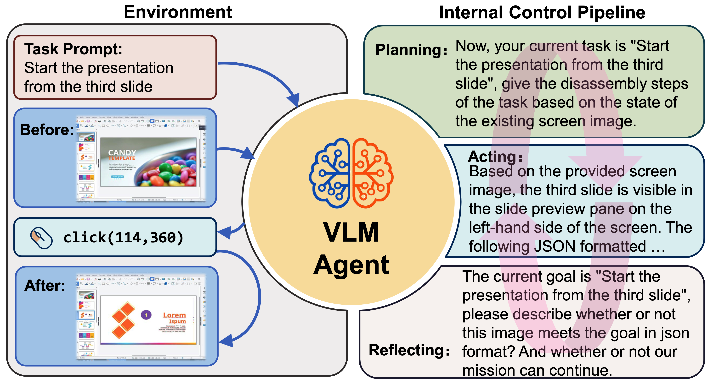

<p align="center">
<h1 align="center"> ScreenAgent: 视觉语言大模型驱动的计算机控制智能体</h1>
</p>

我们构建了 ScreenAgent 项目，为视觉语言模型智能体（VLM Agent）构建了一个与真实计算机屏幕交互的环境。在这个环境中，智能体可以观察屏幕截图，并通过输出鼠标和键盘操作来操纵图形用户界面。我们还设计了一个自动控制流程，其中包括计划、行动和反思阶段，引导智能体与环境持续交互并完成多步骤任务。此外，我们还构建了 ScreenAgent 数据集，该数据集收集了完成各种日常计算机任务时的屏幕截图和动作序列。




项目主要包括以下部分：
```
├── client 客户端代码
├── data 其中包含ScreenAgent数据集和其他视觉定位相关数据集
└── train 训练模型代码
```

# 准备

## 第一步，准备被控制的桌面操作系统
首先你需要准备被控制的桌面操作系统，其中安装VNC Server，如[TightVNC](https://www.tightvnc.com/download.php)。或者你可以使用一个带有GUI的Docker容器，我们准备好了一个容器`niuniushan/screenagent-env`，您可以使用以下的命令来拉取并启动这一容器：

```bash
docker run -d --name ScreenAgent -e RESOLUTION=1024x768 -p 5900:5900 -p 8001:8001 -e VNC_PASSWORD=<VNC_PASSWORD> -e CLIPBOARD_SERVER_SECRET_TOKEN=<CLIPBOARD_SERVER_SECRET_TOKEN> -v /dev/shm:/dev/shm niuniushan/screenagent-env:latest
```

其中，请将`<VNC_PASSWORD>`替换为你设置的新VNC密码，`<CLIPBOARD_SERVER_SECRET_TOKEN>`替换为你的剪贴板服务密码。由于键盘输入长串文本或unicode字符是依靠剪贴板实现的，如果不启用剪贴板服务则只能通过键盘依次按下的方式输入ASCII字符串，无法输入中文等unicode字符，这一镜像中已经包含一个剪贴板服务，默认监听8001端口，你需要设置一个密码来保护你的剪贴板服务。`niuniushan/screenagent-env`是基于`fcwu/docker-ubuntu-vnc-desktop`构建的，你可以在[这里](https://github.com/fcwu/docker-ubuntu-vnc-desktop)找到更多关于这个镜像的信息。

如果您想使用已有的桌面环境，例如Windows、Linux Desktop或其他任何桌面环境，您需要运行任意一种VNC Server，记下来它的IP地址和端口号。如果您想启用剪贴板服务，请在您的桌面环境中执行以下步骤：

```bash
# 安装依赖
pip install fastapi pydantic uvicorn pyperclip 
# 在环境变量中设置密码
export CLIPBOARD_SERVER_SECRET_TOKEN=<CLIPBOARD_SERVER_SECRET_TOKEN>
# 启动剪贴板服务
python client/clipboard_server.py
```

`clipboard_server.py` 将监听8001端口，接收来自控制器的键盘输入长串文本的（text）指令。

保持运行后您可以测试剪贴板服务是否正常工作，例如：

```bash
curl --location 'http://localhost:8001/clipboard' \
--header 'Content-Type: application/json' \
--data '{
    "text":"Hello world",
    "token":"<CLIPBOARD_SERVER_SECRET_TOKEN>"
}'
```

如果正常工作，则会收到`{"success": True, "message": "Text copied to clipboard"}`的响应。
如果遇到“Pyperclip could not find a copy/paste mechanism for your system.” 的错误，请在运行`python client/clipboard_server.py`前增加一个环境变量，指定 X 服务器位置： 

```bash
export DISPLAY=:0.0
```

具体请根据您的系统环境进行调整。如果还出现报错，请参考[这里](https://pyperclip.readthedocs.io/en/latest/introduction.html#not-implemented-error)。


## 第二步，准备控制器代码运行环境

你需要运行控制器的代码，它的使命有三个：首先控制器会连接到VNC Server，采集屏幕截图，发送鼠标和键盘等命令；其次，控制器内部维护一个状态机，实现计划、行动和反思的自动控制流程，引导智能体与环境持续交互；最后，控制器会根据提示词模版来构造完整的提示词，发送给大模型推理API，解析大模型生成回复中的控制命令。控制器是一个基于的PyQt5的程序，你需要安装一些依赖：

```bash
pip install -r client/requirements.txt
```

## 第三步，准备大模型推理器或API

如果需要


## 第四步，准备配置文件


# 运行
准备工作完成后，你可以运行控制器代码了：


# 训练

# TODO
- [ ] 简化控制器的设计，提供 no render 模式。