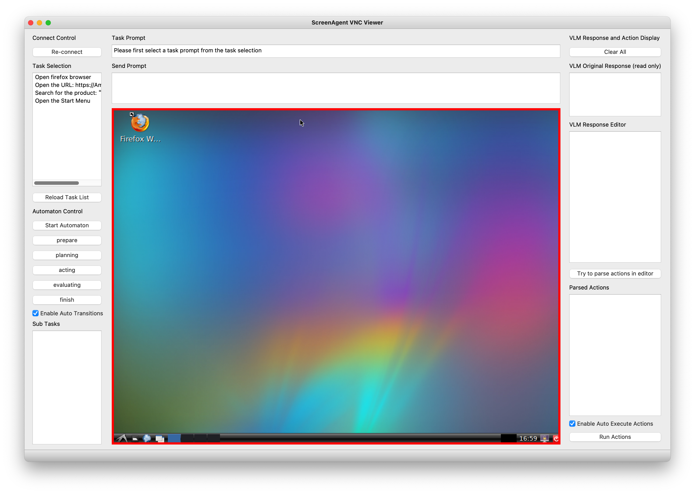

<p align="center">
<h1 align="center"> ScreenAgent: 视觉语言大模型驱动的计算机控制智能体</h1>
</p>

[ScreenAgent 论文链接 arxiv:2402.07945](https://arxiv.org/abs/2402.07945)

我们构建了 ScreenAgent 项目，为视觉语言模型智能体（VLM Agent）构建了一个与真实计算机屏幕交互的环境。在这个环境中，智能体可以观察屏幕截图，并通过输出鼠标和键盘操作来操纵图形用户界面。我们还设计了一个自动控制流程，其中包括计划、行动和反思阶段，引导智能体与环境持续交互并完成多步骤任务。此外，我们还构建了 ScreenAgent 数据集，该数据集收集了完成各种日常计算机任务时的屏幕截图和动作序列。

<div align="center">
  
  <p><i>ScreenAgent 设计动机</i></p>
</div>

为了引导 VLM Agent 与计算机屏幕进行持续的交互，我们构建了一个包含“计划-执行-反思”的运行流程。在计划阶段，Agent 被要求将用户任务拆解为子任务。在执行阶段，Agent 将观察屏幕截图，给出执行子任务的具体鼠标和键盘动作。控制器将执行这些动作，并将执行结果反馈给 Agent。在反思阶段，Agent 将观察执行结果，并判定当前的状态，选择继续执行、重试或调整计划。这一流程将持续进行，直到任务完成。

<div align="center">
  
  <p><i>自动化的运行流程</i></p>
</div>

我们参考了 VNC 远程桌面连接协议来设计Agent的动作空间，其中都是最为基础的鼠标和键盘操作，鼠标的大部分点击操作都需要 Agent 给出精确的屏幕坐标位置。相比起调用特定的 API 来完成任务，这种方式更加通用，可以适用于各种桌面操作系统和应用程序，对用户更具可解释性。

<div align="center">
  
  <p><i>支持的动作类型和动作属性</i></p>
</div>

要教会Agent使用电脑并不是一件简单的事情，需要 Agent 具备任务规划、图像理解、视觉定位、工具使用等多种综合能力，为此我们人工标注了 ScreenAgent 数据集，这一数据集涵盖了多种日常计算机任务，包括文件操作、网页浏览、游戏娱乐等场景。我们按照上述的“计划-执行-反思”的运行流程来构建一个完整 session 。

<div align="center">
  
  <p><i>ScreenAgent 数据集任务类型分布</i></p>
</div>

电脑是人类最为强大且通用的工具，通过训练 ScreenAgent 这样能够使用电脑的模型，有望构建一个更通用的代理，协助人类完成各种日常数字工作。

项目主要包括以下部分：
```
├── client 控制器客户端代码
│   ├── prompt 提示词模版
│   ├── config.yml 控制器客户端配置文件模版
│   └── tasks.txt 任务列表
├── data 其中包含ScreenAgent数据集和其他视觉定位相关数据集
├── model_workers 大模型推理器
└── train 训练模型代码
```

# 准备

## 第一步，准备被控制的桌面操作系统
首先你需要准备被控制的桌面操作系统，其中安装VNC Server，如[TightVNC](https://www.tightvnc.com/download.php)。或者你可以使用一个带有GUI的Docker容器，我们准备好了一个容器`niuniushan/screenagent-env`，您可以使用以下的命令来拉取并启动这一容器：

```bash
docker run -d --name ScreenAgent -e RESOLUTION=1024x768 -p 5900:5900 -p 8001:8001 -e VNC_PASSWORD=<VNC_PASSWORD> -e CLIPBOARD_SERVER_SECRET_TOKEN=<CLIPBOARD_SERVER_SECRET_TOKEN> -v /dev/shm:/dev/shm niuniushan/screenagent-env:latest
```

其中，请将`<VNC_PASSWORD>`替换为你设置的新VNC密码，`<CLIPBOARD_SERVER_SECRET_TOKEN>`替换为你的剪贴板服务密码。由于键盘输入长串文本或unicode字符是依靠剪贴板实现的，如果不启用剪贴板服务则只能通过键盘依次按下的方式输入ASCII字符串，无法输入中文等unicode字符，这一镜像中已经包含一个剪贴板服务，默认监听8001端口，你需要设置一个密码来保护你的剪贴板服务。`niuniushan/screenagent-env`是基于`fcwu/docker-ubuntu-vnc-desktop`构建的，你可以在[这里](https://github.com/fcwu/docker-ubuntu-vnc-desktop)找到更多关于这个镜像的信息。

如果您想使用已有的桌面环境，例如Windows、Linux Desktop或其他任何桌面环境，您需要运行任意一种VNC Server，记下来它的IP地址和端口号。如果您想启用剪贴板服务，请在您的桌面环境中执行以下步骤：

```bash
# 安装依赖
pip install fastapi pydantic uvicorn pyperclip 
# 在环境变量中设置密码
export CLIPBOARD_SERVER_SECRET_TOKEN=<CLIPBOARD_SERVER_SECRET_TOKEN>
# 启动剪贴板服务
python client/clipboard_server.py
```

`clipboard_server.py` 将监听8001端口，接收来自控制器的键盘输入长串文本的（text）指令。

保持运行后您可以测试剪贴板服务是否正常工作，例如：

```bash
curl --location 'http://localhost:8001/clipboard' \
--header 'Content-Type: application/json' \
--data '{
    "text":"Hello world",
    "token":"<CLIPBOARD_SERVER_SECRET_TOKEN>"
}'
```

如果正常工作，则会收到`{"success": True, "message": "Text copied to clipboard"}`的响应。
如果遇到“Pyperclip could not find a copy/paste mechanism for your system.” 的错误，请在运行`python client/clipboard_server.py`前增加一个环境变量，指定 X 服务器位置： 

```bash
export DISPLAY=:0.0
```

具体请根据您的系统环境进行调整。如果还出现报错，请参考[这里](https://pyperclip.readthedocs.io/en/latest/introduction.html#not-implemented-error)。

请将上面的信息填写到配置文件`client/config.yml`的`remote_vnc_server`项中。

## 第二步，准备控制器代码运行环境

你需要运行控制器的代码，它的使命有三个：首先控制器会连接到VNC Server，采集屏幕截图，发送鼠标和键盘等命令；其次，控制器内部维护一个状态机，实现计划、行动和反思的自动控制流程，引导智能体与环境持续交互；最后，控制器会根据提示词模版来构造完整的提示词，发送给大模型推理API，解析大模型生成回复中的控制命令。控制器是一个基于的PyQt5的程序，你需要安装一些依赖：

```bash
pip install -r client/requirements.txt
```

## 第三步，准备大模型推理器或API

请选择一种VLM作为Agent，我们在`model_workers`中提供了4种模型的推理器，分别是：GPT-4V、LLaVA-1.5、CogAgent和ScreenAgent。您也可以自己实现一个推理器或使用第三方API，您可以参考`client/interface_api`下的代码来实现新的API调用接口。

请参考`client/config.yml`中的`llm_api`部分来准备配置文件，`llm_api` 下只保留一种模型即可。

```yaml
llm_api:

  # Select ONE of the following models to use:

  GPT4V:
    model_name: "gpt-4-vision-preview"
    openai_api_key: "<YOUR-OPENAI-API-KEY>"
    target_url: "https://api.openai.com/v1/chat/completions"

  LLaVA:
    model_name: "LLaVA-1.5"
    target_url: "http://localhost:40000/worker_generate"

  CogAgent:
    target_url: "http://localhost:40000/worker_generate"

  ScreenAgent:
    target_url: "http://localhost:40000/worker_generate"

  # Common settings for all models
  temperature: 1.0
  top_p: 0.9
  max_tokens: 500
  
```

### 如果使用GPT-4V作为Agent

请在`client/config.yml`中设置`llm_api`为`GPT4V`，并填写您的OpenAI API Key，请随时注意您的账户余额。

### 如果使用LLaVA-1.5作为Agent

请参考[LLaVA](https://github.com/haotian-liu/LLaVA)项目的来下载准备LLaVA-1.5模型，例如：

```bash
git clone https://github.com/haotian-liu/LLaVA.git
cd LLaVA
conda create -n llava python=3.10 -y
conda activate llava
pip install --upgrade pip  # enable PEP 660 support
pip install -e .
```

`model_workers/llava_model_worker.py`提供了一个LLaVA-1.5非流式的输出的推理器，您可以拷贝到`llava/serve/model_worker`下，并使用以下命令来启动：

```bash
cd llava
python -m llava.serve.llava_model_worker --host 0.0.0.0 --port 40000 --worker http://localhost:40000 --model-path liuhaotian/llava-v1.5-13b --no-register
```

### 如果使用CogAgent作为Agent

请参考[CogVLM](https://github.com/THUDM/CogVLM)项目下载准备CogAgent模型，请在[这里](https://huggingface.co/THUDM/CogAgent/tree/main)下载sat版本的的CogAgent权重`cogagent-chat.zip`，解压后放到`train/saved_models/cogagent-chat`目录下。
`train/cogagent_model_worker.py`提供了一个CogAgent非流式的输出的推理器，并使用以下命令来启动：

```bash
cd train
RANK=0 WORLD_SIZE=1 LOCAL_RANK=0 python ./cogagent_model_worker.py --host 0.0.0.0  --port 40000 --from_pretrained "saved_models/cogagent-chat" --bf16 --max_length 2048
```

### 如果使用ScreenAgent作为Agent

ScreenAgent是在CogAgent的基础上训练的，请到[这里](https://huggingface.co/niurl/ScreenAgent)下载sat格式的权重文件`ScreenAgent-2312.zip`，解压后放在`train/checkpoints/ScreenAgent-2312`，并使用以下命令来启动：

```bash
cd train
RANK=0 WORLD_SIZE=1 LOCAL_RANK=0 python ./cogagent_model_worker.py --host 0.0.0.0  --port 40000 --from_pretrained "saved_models/ScreenAgent-2312" --bf16 --max_length 2048
```

# 运行
准备工作完成后，你可以运行控制器了：

```bash
cd client
python run_controller.py -c config.yml
```

控制器界面如下，您需要先从左侧双击选择一个任务，然后按下“Start Automation”按钮，控制器会按照计划-行动-反思的流程自动运行，控制器会采集当前的屏幕画面、填充提示词模版、发送图像和完整提示词给大模型推理器、解析大模型推理器的回复、发送鼠标键盘控制命令给VNC Server，循环往复。



如果画面卡住，请尝试按下“Re-connect”按钮，控制器会尝试重新连接VNC Server。


# 数据集

所有的数据集和数据集的处理代码都在`data`目录下。我们使用了三个现有数据集COCO2014、Rico & widget-caption、Mind2Web

## COCO Dataset
我们使用COCO 2014 validation images作为视觉定位能力的训练数据集。您可以在[这里](https://cocodataset.org/#download)下载COCO 2014 train images，在这里我们使用的annotation信息是refcoco，split by unc。

```
├── COCO
   ├── prompts # 用于训练Agent视觉定位能力的提示词模板
   ├── train2014 # COCO 2014 train
   └── annotations # COCO 2014 annotations
```

## Rico & widget-caption Dataset

Rico 是一个包含了大量Android应用的截图和控件信息的数据集，您可以在[这里](http://www.interactionmining.org/rico.html)下载Rico数据集中 “1. UI Screenshots and View Hierarchies (6 GB)“ 的部分，文件名是`unique_uis.tar.gz`，请将解压后文件夹`combined`放在`data/Rico`目录下。
widget-caption 是在Rico基础上对控件信息进行了标注，请在`data/Rico`下克隆`https://github.com/google-research-datasets/widget-caption`项目。
最终目录结构如下：
```
├── Rico
   ├── prompts # 用于训练Agent视觉定位能力的提示词模板
   ├── combined # Rico dataset screenshots
   └── widget-caption
       ├── split
       │   ├── dev.txt
       │   ├── test.txt
       │   └── train.txt
       └── widget_captions.csv
```

## Mind2Web Dataset

[Mind2Web](https://osu-nlp-group.github.io/Mind2Web/) 是一个真实模拟网页浏览数据集，您需要下下载原始数据集并进行处理，首先使用globus工具下载[这里](https://app.globus.org/file-manager?origin_id=32e6b738-a0b0-47f8-b475-26bf1c5ebf19)的原始网页截图，文件夹名称为`raw_dump`，放置在`data/Mind2Web/raw_dump`目录下，然后使用以下命令来处理数据集：

```bash
cd data/Mind2Web
python convert_dataset.py
```

这段代码中会从huggingface datasets中下载`osunlp/Mind2Web`数据集的处理形式，请确保网络畅通，同时这一步会涉及到将英文指令翻译成中文指令，您需要在`data/Mind2Web/translate.py`中调用你自己的翻译API。
目录结构如下：
```
├── Mind2Web
   ├── convert_dataset.py
   ├── translate.py
   ├── prompts # 用于训练Agent网页浏览能力的提示词模板
   ├── raw_dump # Mind2Web raw_dump downloaded from globus
   └── processed_dataset # Created by convert_dataset.py
```

## ScreenAgent Dataset

ScreenAgent是本文标注的数据集，分为训练和测试集合，目录结构如下：

```
├── data
    ├── ScreenAgent
        ├── train
        │   ├── <session id>
        │   │   ├── images
        │   │   │   ├── <timestamp-1>.jpg
        │   │   │   └── ...
        │   │   ├── <timestamp-1>.json
        │   │   └── ...
        │   ├── ...
        └── test
```

json文件中每个字段的含义：
- session_id：Session ID
- task_prompt：任务总体的目标
- task_prompt_en：任务总体的目标（En）
- task_prompt_zh：任务总体的目标（Zh）
- send_prompt：发送给模型的完整提示词
- send_prompt_en：发送给模型的完整提示词（En）
- send_prompt_zh：发送给模型的完整提示词（Zh）
- LLM_response：模型给出的原始回复文本，即RLHF中的 reject response
- LLM_response_editer：人工修正后的回复文本，即RLHF中的 choice response
- LLM_response_editer_en：人工修正后的回复文本（En）
- LLM_response_editer_zh：人工修正后的回复文本（Zh）
- video_height，video_width：图像的高度和宽度
- saved_image_name：截图文件名，在每个session的images文件夹下
- actions：从 LLM_response_editer 中解析出的动作序列

# 训练 ScreenAgent
如果你想训练自己的模型，或复现ScreenAgent模型，请先准备好以上的数据集，并在`train/dataset/mixture_dataset.py`文件中核对所有数据集的路径，如果只想使用其中一部分数据集或增加新的数据集，请在`train/dataset/mixture_dataset.py`中修改`make_supervised_data_module`函数。请在[这里](https://huggingface.co/THUDM/CogAgent/tree/main)下载sat版本的的CogAgent权重`cogagent-chat.zip`，解压后放到`train/saved_models/`目录下。

您需要关注并检查以下文件：
```
train
├── data -> ../data
├── dataset
│   └── mixture_dataset.py
├── finetune_ScreenAgent.sh
└── saved_models
    └── cogagent-chat # unzip cogagent-chat.zip
        ├── 1
        │   └── mp_rank_00_model_states.pt
        ├── latest
        └── model_config.json
```

请根据您设备情况修改`train/finetune_ScreenAgent.sh`里面的参数，之后运行：
```bash
cd train
bash finetune_ScreenAgent.sh
```

最后如果想将sat分布式训练的权重合并为一个权重文件，请参考`train/merge_model.sh`代码，请确保该文件中模型并行的个数`MP_SIZE`与`train/finetune_ScreenAgent.sh`中的`WORLD_SIZE`保持一致。修改`--from-pretrained`后参数为训练时存储的checkpoint位置。合并后的权重文件将保存为`train/saved_models/merged_model`文件夹。


# TODO
- [ ] 提供huggingface版本权重。
- [ ] 简化控制器的设计，提供 no render 模式。
- [ ] 集成Gym。
